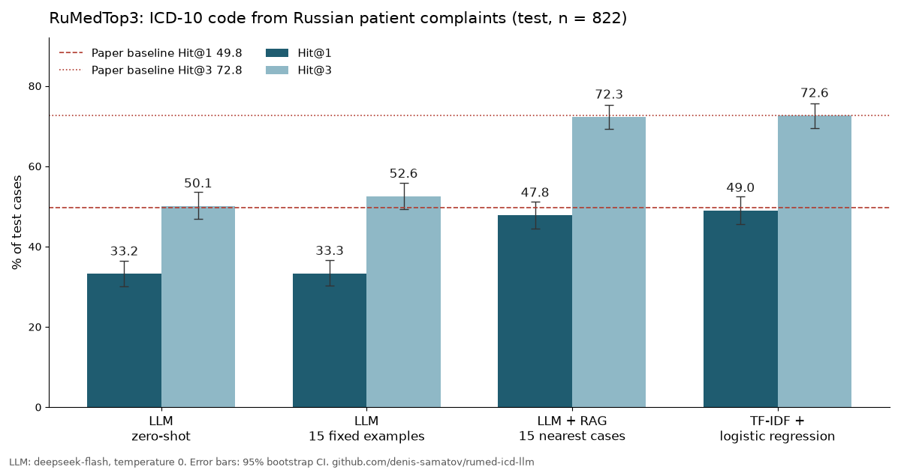

# rumed-icd-llm

Prompting vs RAG vs LoRA fine-tuning for ICD-10 coding of Russian clinical complaints, with vLLM serving costs. All methods are evaluated on the same public test split, and every number in this README comes from `results/`.

**Status:** stages A and B are done. Method 0 reproduces the paper baseline, and methods 1–2 have been run on the DeepSeek API. Method 3 (LoRA) and serving are next.

## Task and data

[RuMedTop3](https://github.com/sb-ai-lab/MedBench) (RuMedBench, [arXiv:2201.06499](https://arxiv.org/abs/2201.06499)) asks the model to predict the ICD-10 code from free-text patient complaints. Metrics are Hit@1 and Hit@3.

| Item | Source | License |
|---|---|---|
| Benchmark code and splits | sb-ai-lab/MedBench | Apache-2.0 |
| Underlying records | RuMedPrime, [Zenodo 5765873](https://zenodo.org/records/5765873) | CC BY 3.0 |

The data is not stored in this repository. To download it and record checksums, run `scripts/download_data.sh`.

## Methods

| # | Method | Status |
|---|---|---|
| 0 | TF-IDF (word + char n-grams) + logistic regression | implemented. It is a harness sanity check against the paper's feature-based baseline (test Hit@1 49.76 / Hit@3 72.75) |
| 1 | Zero-shot and few-shot prompting (15 fixed random training cases) | implemented on the DeepSeek API (`deepseek-flash`, temperature 0, thinking disabled); planned on the same open-weight base model as method 3 |
| 2 | RAG: the 15 most similar training cases in the prompt (TF-IDF char n-gram cosine, retrieval over train only) | implemented, as for method 1 |
| 3 | LoRA / QLoRA SFT (PEFT, TRL) | planned |
| 4 | vLLM serving, fp16 vs AWQ: p50/p95 latency, tokens/s, cost per 1k requests | planned |

Every result reports a 95% bootstrap confidence interval and the rate of invalid ICD-10 codes.

## Run

```bash
scripts/download_data.sh
uv run pytest
uv run python -m rumed_icd.evaluate --method tfidf --split dev
# LLM methods need DEEPSEEK_API_KEY in the environment or in .env (gitignored)
uv run python -m rumed_icd.evaluate --method rag --split dev
```

LLM responses are cached in `results/cache/`, keyed by example and prompt hash. An interrupted run resumes without paying for the same request twice.

## Results

Data files are pinned by `data/raw/SHA256SUMS`. Splits: train 4,690, dev 848, test 822; 105 ICD-10 codes appear in train.



Test split, n = 822. Dev results are in `results/*_dev.json` and show the same ranking. To regenerate the chart, run `uv run --with matplotlib python scripts/plot_results.py`.

| Method | Hit@1 (95% CI) | Hit@3 (95% CI) | Top-1 outside label set | API cost, full test run |
|---|---|---|---|---|
| Paper, feature-based | 49.76 | 72.75 | — | — |
| 0 · TF-IDF + LR | 49.03 (45.62–52.43) | 72.63 (69.46–75.67) | 0% | — |
| 1 · zero-shot, `deepseek-flash` | 33.21 (30.05–36.37) | 50.12 (46.96–53.53) | 4.0% | ≤ $0.07 |
| 1 · few-shot, 15 fixed cases | 33.33 (30.29–36.62) | 52.55 (49.27–55.84) | 3.0% | ≤ $0.08 |
| 2 · RAG, 15 nearest training cases | 47.81 (44.40–51.22) | 72.26 (69.34–75.30) | 1.1% | ≤ $0.34 |

Costs are upper bounds at peak-hour prices, computed from the token usage the API reported.

**What this shows so far**

- **Method 0 validates the harness.** It reproduces the paper's feature-based baseline within its confidence interval. Its hyperparameters (C = 10, word 1–2-grams, char 2–5-grams) were fixed before the first run and were not tuned on test.
- **A general-purpose API LLM without dataset examples is about 16 points below a linear classifier on Hit@1.** The labels follow the dataset's own coding practice: a few codes such as M54, I11 and G54 dominate. That practice is not recoverable from general ICD-10 knowledge.
- **Fixed few-shot examples barely help.** Retrieved nearest cases (RAG) close the gap to the TF-IDF baseline, but they do not beat it: the two are within each other's 95% CIs.
- **This sets the bar for LoRA (method 3).** Fine-tuning has to beat about 49 / 73 to justify itself over a classifier that trains in seconds.
