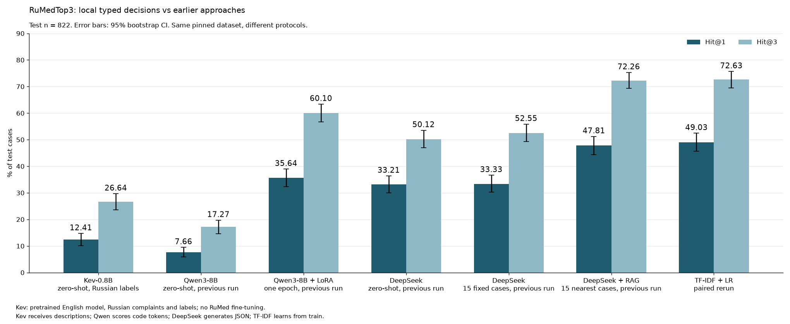

# rumed-icd-llm

ICD-10 coding of Russian patient complaints: prompting, RAG, local Qwen3-8B QLoRA and Kev-0.8B typed decisions. Full dev/test measurements are published in `results/`, with reproducible CPU verification for the local models.

## Task and data

[RuMedTop3](https://github.com/sb-ai-lab/MedBench) ([RuMedBench paper](https://arxiv.org/abs/2201.06499)) predicts an ICD-10 code from free-text complaints. Metrics are Hit@1 and Hit@3. Splits: train **4,690**, dev **848**, test **822**; train contains **105 codes**.

| Item | Source | License |
|---|---|---|
| Benchmark code and splits | sb-ai-lab/MedBench | Apache-2.0 |
| Underlying records and derived labels | RuMedPrime, [Zenodo 5765873](https://zenodo.org/records/5765873) | CC BY 3.0 |

Raw records are downloaded separately. `scripts/download_data.sh` stages the files, verifies `data/raw/SHA256SUMS`, then installs them. Loading a split also verifies its checksum. Repository code uses its own license.

## Results

Full test, **n = 822**. Intervals are 95% record-bootstrap CIs, 2,000 resamples, seed 0. The paper baseline is an external reference; all other scores below come from committed results.



| Method | Hit@1 (95% CI), % | Hit@3 (95% CI), % |
|---|---|---|
| Paper, feature-based reference | 49.76 | 72.75 |
| TF-IDF + logistic regression | **49.03 (45.62–52.43)** | **72.63 (69.46–75.67)** |
| DeepSeek, zero-shot | 33.21 (30.05–36.37) | 50.12 (46.96–53.53) |
| DeepSeek, 15 fixed examples | 33.33 (30.29–36.62) | 52.55 (49.27–55.84) |
| DeepSeek + RAG, 15 nearest train cases | 47.81 (44.40–51.22) | 72.26 (69.34–75.30) |
| Qwen3-8B, zero-shot | 7.66 (5.96–9.49) | 17.27 (14.60–19.71) |
| Qwen3-8B + LoRA, one epoch | 35.64 (32.36–38.93) | 60.10 (56.69–63.38) |
| Kev-0.8B, zero-shot with Russian labels | 12.41 (10.10–14.72) | 26.64 (23.60–29.68) |

- **TF-IDF is the strongest measured method.** Its fixed configuration gives aggregate scores close to the paper reference; that does not establish exact reproduction of the paper's implementation.
- **Retrieved examples help DeepSeek more than fixed examples.** The recorded RAG score is close to TF-IDF, but overlapping individual CIs do not establish equivalence or test a paired difference.
- **LoRA improves the same Qwen3 base but remains below TF-IDF.** The within-model paired comparison is documented in the [Qwen3 experiment](docs/qwen3_experiment.md#one-epoch-full-held-out-evaluation).
- **Kev transfers poorly in the tested configuration.** It is an English-declared checkpoint tested on Russian medical text without RuMed fine-tuning; larger checkpoints and causes of the gap remain untested.

These are comparisons of protocols as well as models: DeepSeek generates JSON, Qwen ranks code-token likelihoods, and Kev ranks a single choice question with all codes and Russian descriptions. TF-IDF learns from train. Earlier methods and the Kev study use the same pinned test records; this is an incremental benchmark, not a new independent confirmation dataset.

## Methods and experiment guides

| Method | Measured status and guide |
|---|---|
| TF-IDF: word + char n-grams, logistic regression | Fixed C=10, word 1–2-grams, char 2–5-grams; full dev/test scores; paired control rerun for Kev |
| DeepSeek zero-shot, few-shot, RAG | Full dev/test API runs, `deepseek-flash`, temperature 0; [protocol, chart, invalid/outside-label rates and costs](docs/prompting_rag.md) |
| Qwen3-8B 4-bit + MLX QLoRA | One epoch complete, full dev/test base and LoRA scores; [training, predictions and paired statistics](docs/qwen3_experiment.md) |
| vLLM-Metal with PEFT adapter | Local API smoke checked; [installation and serving](docs/qwen3_experiment.md#serve-the-adapter-with-vllm-metal); throughput and quantization study pending |
| Kev-0.8B typed decisions | Full dev/test scores, local latency and real TypeSafe SDK check; [pinned setup, calibration plot and reproduction](docs/kev_research.md) |

Local Qwen3 few-shot and RAG are implemented but have not been evaluated.

## Run and verify

```bash
uv sync --locked
scripts/download_data.sh
uv run --locked pytest -q
uv run --locked python -m rumed_icd.evaluate --method tfidf --split dev --output-dir /tmp/rumed-rerun
# API methods need DEEPSEEK_API_KEY in the environment or .env (gitignored).
uv run --locked python -m rumed_icd.evaluate --method rag --split dev --output-dir /tmp/rumed-rerun
```

API responses are cached in `results/cache/` by example and prompt hash and saved as they arrive. A fully cached run needs no API key. A lost response before caching can require another request; concurrent evaluators sharing one cache are unsupported. Use a separate `--output-dir` to preserve published results. Positive `--limit` runs write distinct smoke files and are not full-split scores.

Reconstruct published local metrics and paired CIs on CPU without model weights or API access, then regenerate the overview chart:

```bash
uv run --locked python scripts/verify_qwen3_results.py
uv run --locked python scripts/verify_kev_results.py
uv run --locked --with matplotlib python scripts/plot_kev_results.py
```

The experiment guides above contain the separate Apple Silicon environments, model downloads, training and serving commands.

## Evidence limits

This is research software for dataset-specific coding. Record splits do not establish patient-disjoint validation, another institution's performance, or clinical utility. No private institutional data is used.

Qwen3 and Kev public predictions contain IDs, codes and no complaint text; Kev also includes unrounded probabilities and timings. CPU verification checks saved predictions and calculations; reproducing inference requires the pinned weights and runtime. DeepSeek response caches are not committed, so independent reconstruction requires corresponding responses or a new API run.

Forced choice guarantees label validity for the local scorers, not medical correctness or abstention. Qwen BF16 scoring can reorder close candidates between cached and direct execution; the documented numerical checks cover only a small dev sample. Kev's shipped temperature was not calibrated on RuMed, and small high-probability bins do not establish reliable confidence.

API smoke checks establish interface behavior, separately from classification quality and load testing. Kev latency measures warm batch-1 library execution; its MLX peak counts Metal allocations rather than total RAM. GPU latency, serving throughput, quantization comparisons and serving cost need separate evidence. Offline tests mock paid calls.
