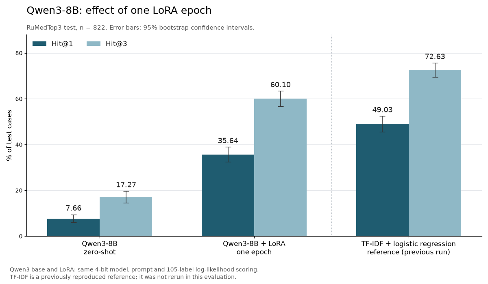

# rumed-icd-llm

Prompting vs RAG for ICD-10 coding of Russian clinical complaints, with local Qwen3-8B QLoRA training and vLLM-Metal serving. Published full-test numbers in this README come from `results/`; the paper baseline is an external reference.

**Status:** methods 0–2 have full-test API/classifier results. One Qwen3-8B QLoRA epoch is complete, with full dev/test zero-shot and LoRA scores. Local few-shot/RAG and the serving performance study remain pending.

## Task and data

[RuMedTop3](https://github.com/sb-ai-lab/MedBench) (RuMedBench, [arXiv:2201.06499](https://arxiv.org/abs/2201.06499)) asks the model to predict the ICD-10 code from free-text patient complaints. Metrics are Hit@1 and Hit@3.

| Item | Source | License |
|---|---|---|
| Benchmark code and splits | sb-ai-lab/MedBench | Apache-2.0 |
| Underlying records | RuMedPrime, [Zenodo 5765873](https://zenodo.org/records/5765873) | CC BY 3.0 |

The data is not stored in this repository. `scripts/download_data.sh` downloads into a staging directory, verifies the committed `data/raw/SHA256SUMS`, and then installs the files. It refuses changed upstream data without replacing the checksum manifest. Loading a split also verifies its checksum.

## Methods

| # | Method | Status |
|---|---|---|
| 0 | TF-IDF (word + char n-grams) + logistic regression | implemented. It is a harness sanity check against the paper's feature-based baseline (test Hit@1 49.76 / Hit@3 72.75) |
| 1 | Zero-shot and few-shot prompting (15 fixed random training cases) | full DeepSeek API results (`deepseek-flash`, temperature 0, thinking disabled); full Qwen3 zero-shot results; local few-shot implemented, not evaluated |
| 2 | RAG: the 15 most similar training cases in the prompt (TF-IDF char n-gram cosine, retrieval over train only) | full DeepSeek results; local Qwen3 RAG implemented, not evaluated |
| 3 | QLoRA SFT on Qwen3-8B 4-bit with MLX | one epoch complete; full dev/test evaluation below |
| 4 | Local vLLM-Metal serving with a PEFT adapter | implemented; fp16/AWQ latency and throughput study remains pending |

Every result reports a 95% bootstrap confidence interval and the rate of invalid ICD-10 codes.

## Run

```bash
scripts/download_data.sh
uv run pytest
uv run python -m rumed_icd.evaluate --method tfidf --split dev
# LLM methods need DEEPSEEK_API_KEY in the environment or in .env (gitignored)
uv run python -m rumed_icd.evaluate --method rag --split dev
```

LLM responses are cached in `results/cache/`, keyed by example and prompt hash. Completed responses are written as they arrive, including when another request fails. A fully cached run requires no API key. A lost response before it is cached can still require a new request; concurrent evaluator processes sharing one cache are unsupported.

Use `--output-dir /tmp/rumed-rerun` to preserve the committed metric files during verification. `--limit` must be positive and writes a separate smoke result; it is not a full-split score.

### Qwen3 training on Apple Silicon

Use a native arm64 Python with `uv sync --locked --extra mlx`. The base model is
`mlx-community/Qwen3-8B-4bit`, revision `545dc4251c05440727734bcd94334791f6ab0192`.
Set `RUMED_MODEL_PATH` to that downloaded snapshot for offline operation.

```bash
# A bounded pipeline check, written separately from the full training run.
uv run --locked --extra mlx python -m rumed_icd.train_lora \
  --max-steps 5 --dev-loss-examples 8 --output adapters/pilot/lora_qwen3_8b.safetensors
# One complete epoch over train; dev is used only to measure loss.
uv run --locked --extra mlx python -m rumed_icd.train_lora
# Same model and scoring rule; inspect dev before freezing test evaluation.
uv run --locked --extra mlx python -m rumed_icd.evaluate --method local_zero_shot --split dev
uv run --locked --extra mlx python -m rumed_icd.evaluate --method local_lora --split dev
# After freezing choices, evaluate the held-out test split.
uv run --locked --extra mlx python -m rumed_icd.evaluate --method local_zero_shot --split test
uv run --locked --extra mlx python -m rumed_icd.evaluate --method local_lora --split test
# Also available: local_few_shot and local_rag, retrieval over train only.
```

The adapter trains the last 16 blocks, rank 8, MLX scale 20, learning rate 1e-4,
one epoch, seed 0. Microbatch 1 with accumulation 4 and gradient checkpointing
keeps memory bounded. Loss is computed in float32 on the three observed code tokens
and the end-of-turn token only. No additional gold labels are invented.
Every 10 optimizer steps, adapter weights and a progress JSON are saved atomically.
These are weight checkpoints; they do not restore optimizer state for an exact resume.
Existing adapter files are not overwritten when starting a run.

Local predictions rank all 105 training codes by three-token log-likelihood.
They use the same non-thinking prompt for base and LoRA. This forced-choice rule
differs from the DeepSeek JSON generation experiment, and makes label validity
automatic. Cached results include the prompt, model revision and adapter hash.
BF16 execution can change rankings of close candidates between cached and direct
prefill; numerical checks must accompany any full result. A short dev sample and
loss reduction do not establish improvement on the full held-out benchmark.

### Serve the adapter with vLLM-Metal

The community [vLLM-Metal plugin](https://github.com/vllm-project/vllm-metal)
uses an independent environment because it pins a different MLX build:

```bash
uv venv --python 3.12 .venv-vllm
uv pip install --python .venv-vllm/bin/python \
  'https://github.com/vllm-project/vllm/releases/download/v0.30.0/vllm-0.30.0%2Bcpu-cp312-cp312-macosx_11_0_arm64.whl' \
  'https://github.com/vllm-project/vllm-metal/releases/download/v0.30.0/vllm_metal-0.30.0-cp312-cp312-macosx_15_0_arm64.whl'
uv run --locked --extra mlx python -m rumed_icd.export_peft \
  --adapter adapters/lora_qwen3_8b.safetensors --output adapters/qwen3-peft
RUMED_VLLM_BIN="$PWD/.venv-vllm/bin/vllm" bash scripts/serve_local.sh "$PWD/adapters/qwen3-peft"
```

The exporter transposes MLX matrices into PEFT orientation and sets alpha to
`scale * rank`. The base quantization is preserved. The API binds to
`http://127.0.0.1:8001/v1` by default (`RUMED_PORT=8002` selects another port);
request `model: "rumed"` to use the adapter and
`model: "qwen3-base"` for the base. Pass `chat_template_kwargs: {"enable_thinking": false}`
in chat requests to match the training prompt. Serving generates text; the local
benchmark's label-set scorer is a separate evaluation path.

`scripts/run_local.sh` runs the full epoch, exports and starts the API in sequence.
It requires `RUMED_VLLM_BIN` to identify the independent serving environment.
Training and serving are sequential to avoid two 8B models sharing 16 GB RAM.

## Results

Data files are pinned by `data/raw/SHA256SUMS`. Splits: train 4,690, dev 848, test 822; 105 ICD-10 codes appear in train.


Test split, n = 822. Dev results are in `results/*_dev.json` and show the same ranking. To regenerate the chart, run `uv run --with matplotlib python scripts/plot_results.py`.

| Method | Hit@1 (95% CI) | Hit@3 (95% CI) | Top-1 outside label set | API cost, full test run |
|---|---|---|---|---|
| Paper, feature-based | 49.76 | 72.75 | — | — |
| 0 · TF-IDF + LR | 49.03 (45.62–52.43) | 72.63 (69.46–75.67) | 0% | — |
| 1 · zero-shot, `deepseek-flash` | 33.21 (30.05–36.37) | 50.12 (46.96–53.53) | 4.0% | ≤ $0.07 |
| 1 · few-shot, 15 fixed cases | 33.33 (30.29–36.62) | 52.55 (49.27–55.84) | 3.0% | ≤ $0.08 |
| 2 · RAG, 15 nearest training cases | 47.81 (44.40–51.22) | 72.26 (69.34–75.30) | 1.1% | ≤ $0.34 |

Costs are upper bounds at the recorded peak-hour prices, computed from the token usage the API reported. They estimate one full evaluation, including reused cached responses, rather than the amount billed for a replay. New runs report `new_requests` and `reused_responses` separately. These API costs do not measure vLLM serving costs.

**What this shows so far**

- **Method 0 is a harness sanity check.** Its score is close to the paper's feature-based baseline. Its hyperparameters (C = 10, word 1–2-grams, char 2–5-grams) were fixed before the first run and were not tuned on test. Agreement of aggregate scores does not establish exact reproduction of the paper's implementation.
- **A general-purpose API LLM without dataset examples is about 16 points below a linear classifier on Hit@1.** The labels follow the dataset's own coding practice: a few codes such as M54, I11 and G54 dominate. That practice is not recoverable from general ICD-10 knowledge.
- **Fixed few-shot examples barely help in the recorded run.** Retrieved nearest cases (RAG) close the gap to TF-IDF; the observed RAG score is slightly lower. Overlapping individual confidence intervals do not establish equivalence or test the paired difference. Per-example predictions and a paired comparison are needed for that conclusion.
- **This sets the bar for LoRA (method 3).** The one-epoch Qwen3 result below improves its own base, but remains below TF-IDF on both metrics.

### Qwen3-8B: one epoch, full held-out evaluation

Measured on 2026-10-06 using MLX 0.32.3 / mlx-lm 0.32.0 on an Apple M2 Pro
with 16 GB RAM. Base and LoRA use the same pinned 4-bit model revision,
non-thinking prompt and scoring rule: sum of log-probabilities of three code
tokens, ranking all 105 train labels; the end-of-turn token is not scored.
Weights and hyperparameters were fixed before this evaluation, including test.



Regenerate this separate Qwen3 chart from the committed metric files with
`uv run --with matplotlib python scripts/plot_qwen3_results.py`.

| Split | Model | Hit@1 (95% CI) | Hit@3 (95% CI) |
|---|---|---|---|
| dev, n=848 | Qwen3 base, zero-shot | 10.38 (8.49–12.62) | 23.11 (20.40–25.94) |
| dev, n=848 | Qwen3 + LoRA | 35.85 (32.78–39.03) | 57.78 (54.60–61.20) |
| test, n=822 | Qwen3 base, zero-shot | 7.66 (5.96–9.49) | 17.27 (14.60–19.71) |
| test, n=822 | Qwen3 + LoRA | **35.64 (32.36–38.93)** | **60.10 (56.69–63.38)** |

Paired LoRA minus base differences on test are **+27.98 percentage points**
for Hit@1 (95% CI +24.33 to +31.75) and **+42.82 points** for Hit@3
(+38.69 to +46.96), using 2,000 bootstrap resamples, seed 0.
LoRA improves its base but does **not** beat the previously reproduced TF-IDF
result of 49.03 / 72.63 on the same test bytes. TF-IDF was not rerun during
this Qwen3 evaluation. Local few-shot and RAG have not been measured.

Training completed 1,173 optimizer steps over 4,690 train records, one epoch,
in 23,576 seconds (6 h 32 min 56 s), with 7.075 GiB peak MLX memory.
Loss on the fixed 32-example dev subset decreased from 3.1931 to 0.5376;
this subset loss is separate from the full-split accuracy above.
The checkpoint contains weights only, without optimizer state.

[Training metadata](results/qwen3_training.json) and
[evaluation provenance and paired statistics](results/qwen3_summary.json)
record the model revision, adapter SHA-256, dataset and prediction hashes.
The model weights are not committed. The prediction files contain benchmark
record IDs, gold codes and base/LoRA top-three codes, without complaint text:
[dev](results/qwen3_predictions_dev.jsonl), [test](results/qwen3_predictions_test.jsonl).
These dataset-derived labels retain the RuMedPrime CC BY 3.0 attribution
listed above; repository code uses its own license.

Independently reconstruct the published metrics and paired confidence
intervals on CPU, without model weights, an API key or a model download:

```bash
uv sync --locked
uv run python scripts/verify_qwen3_results.py
```

This verifies the saved predictions and aggregate calculations; rerunning
model inference requires the optional MLX environment and a trained adapter.
BF16 differences between cached and direct scoring may reorder close
candidates. Direct evaluation of all 105 codes agreed on top-three rankings
for two checked dev cases; this does not establish agreement on all records.
The serving API was also checked with the full adapter, but that smoke is
separate from classification accuracy and is not a latency benchmark.

## Evidence limits

This benchmark is research software for dataset-specific coding, not a diagnostic service. Its record split does not establish patient-disjoint validation, performance at another institution, or clinical utility. No private institutional data is used here.

The API runs use a different model and scoring rule from the open-weight LoRA experiment. The same-base zero-shot/LoRA comparison is measured above; the four-way local comparison still needs few-shot and RAG results. GPU latency, throughput, quantization comparisons and serving cost require separate evidence.

Committed DeepSeek metric summaries do not contain the response cache. Independent score reconstruction for those API methods requires corresponding responses or a new API run. Qwen3 per-example predictions are included and can be independently rescored on CPU. Offline tests mock all paid calls.
