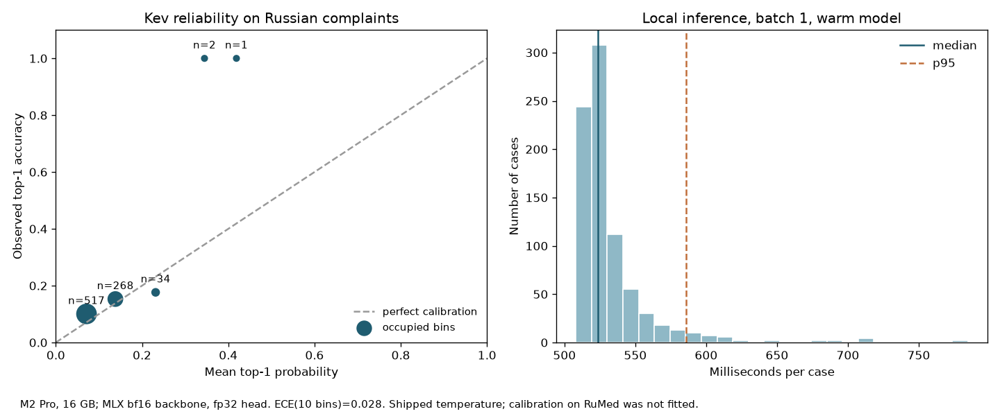

# Kev-0.8B: typed decisions on Russian ICD-10 complaints

This study tests whether a small pretrained typed-decision model transfers to
RuMedTop3 without medical fine-tuning. It does not train Kev on RuMed. The
[Kev-0.8B model card](https://huggingface.co/jaredpalmer/kev-0.8b) declares English
as its language; Russian complaints and ICD coding are a deliberate transfer test.
The choice of 0.8B reflects the local M2 Pro / 16 GB machine. The upstream README
recommends a 32 GB Mac for 4B and 9B. This experiment does not establish that 0.8B
is the most accurate member of the family.

[Benchmark overview and shared evidence limits](../README.md). Run commands from the repository root.

## Results

Measured on 2026-10-07, Apple M2 Pro / 16 GB.

[All-method test comparison](../README.md#results).

| Split | Method | Hit@1 (95% CI) | Hit@3 (95% CI) |
|---|---|---|---|
| dev, n=848 | Kev-0.8B, zero-shot | 15.57 (13.09–17.92) | 28.54 (25.47–31.60) |
| dev, n=848 | TF-IDF + LR, paired rerun | 48.58 (45.17–52.00) | 72.29 (69.10–75.24) |
| test, n=822 | Kev-0.8B, zero-shot | 12.41 (10.10–14.72) | 26.64 (23.60–29.68) |
| test, n=822 | TF-IDF + LR, paired rerun | 49.03 (45.62–52.43) | 72.63 (69.46–75.67) |

**Finding:** this Kev configuration transfers poorly to RuMed and is not a replacement
for the trained TF-IDF classifier. On test, paired Kev minus TF-IDF differences are
−36.62 percentage points for Hit@1 (95% CI −40.51 to −32.60) and −45.99 for Hit@3
(−50.24 to −41.85). Kev scores above the earlier Qwen3 base, but below its LoRA
adapter. Kev receives label descriptions, Qwen ranks code-token likelihoods, and
DeepSeek generates JSON; these results compare protocols as well as models. The
negative result does not identify whether language, domain, model size or option
format is responsible, and does not evaluate larger Kev checkpoints.



Batch-1 warm inference: median **523 ms**, p95 **586 ms** on 822 test cases,
including tokenization, prefill and decision scoring. Test MLX peak allocations:
**2.57 GiB**, excluding CPU allocations and whole-system memory. The shipped
temperature gives multiclass Brier **0.952806** and ten-bin top-label ECE
**0.027855**; mean maximum option probability is **10.08%**. Small upper bins
contain only one or two cases, so the plot does not establish reliable high-confidence
behavior. This reliability calculation uses maximum option probability, not the
SDK's separate `confidence` field.

The local API also passed a synthetic check through **typesafe-sdk 0.6.0**:
`choice`, `noul`, `score`, and a 105-option choice all parsed correctly. That
interface check is stored in `results/kev_api_smoke.json` and is separate from
RuMed accuracy and serving load/performance evidence.

## Frozen protocol

- Runtime: [jaredpalmer/kev](https://github.com/jaredpalmer/kev), commit
  `5e42a7a03f28134853dd3ff77461457e921e5ec1`; its own `uv.lock`, separate Python 3.12 environment.
- Adapter and pointer head: `jaredpalmer/kev-0.8b`, revision
  `bf75a6a8848ea6960ff2ed108d9ed44c2941174f`, Apache-2.0.
- Backbone: `Qwen/Qwen3.5-0.8B-Base`, revision
  `dc7cdfe2ee4154fa7e30f5b51ca41bfa40174e68`, Apache-2.0.
- MLX bf16 backbone, fp32 pointer head, shipped temperature (~2.35). The head
  scores supplied options directly; it does not generate code strings.
- One `choice` question per record, all 105 train codes at once, lexical option
  order. Each option has a Russian dictionary description. No examples, retrieval,
  additional abstention label, prompt search, fine-tuning or RuMed calibration.
- Instruction: `По жалобам пациента выбери наиболее вероятный код диагноза МКБ-10.
  Используй только предложенные варианты с описаниями диагнозов.`
- No state or option truncation. The evaluator refuses context overflow and
  incomplete/invalid probability distributions. Top-3 uses unrounded internal
  probabilities, avoiding the public API's four-decimal serialization ties.
- Labels: `data/icd_labels_ru.json`, generated from the train code set and
  [ak4nv/mkb10](https://github.com/ak4nv/mkb10), commit
  `519b65e608d7f15beb947cb0d7bc14071018a710`, directory v2.27.
  Repository MIT notice is preserved in `ICD_LABELS_LICENSE.txt`.
- Train 4,690; dev 848; test 822; dataset hashes in `data/raw/SHA256SUMS`.
  Dev is read before test to verify execution; no model/prompt changes are selected
  using either split. The exact runtime, versions, hashes and instruction are
  frozen in `results/kev_protocol.json` before the full test run.

TF-IDF is refitted with the existing fixed implementation (C=10, word 1–2-grams,
char 2–5-grams) on train only. Paired differences use these newly saved per-record
predictions. Previous Qwen and DeepSeek results are historical references on the
same pinned test records, with different scoring/training protocols. Kev receives
dictionary descriptions, unlike the earlier Qwen code-token scorer; differences
cannot be attributed to model architecture alone.
This project has evaluated the same test split with earlier methods; this is an
incremental benchmark comparison, not a new independent confirmation dataset.

## Reproduce

On Apple Silicon, prepare the independent runtime and public weights:

```bash
bash scripts/setup_kev.sh
scripts/download_data.sh
# Choose a new results directory: published files are never overwritten.
export PYTHONPATH="$PWD/src"
export HF_HOME="$PWD/.kev/hf"
export HF_HUB_OFFLINE=1
export TRANSFORMERS_OFFLINE=1
.kev/env/bin/python -m rumed_icd.kev_eval \
  --checkpoint-path .kev/adapter --split dev --limit 2 --output-dir /tmp/kev-smoke
.kev/env/bin/python -m rumed_icd.kev_eval \
  --checkpoint-path .kev/adapter --split dev --output-dir /tmp/kev-full
.kev/env/bin/python -m rumed_icd.kev_eval \
  --checkpoint-path .kev/adapter --split test --output-dir /tmp/kev-full
```

The evaluator imports the pinned Kev package from its independent environment.
It verifies adapter/head/base weight hashes and the runtime commit. The frozen
test run requires a protocol already written during dev. Stop other large local
model processes while measuring; on 16 GB, run this sequentially with the 8B server.
Downloads and dependency installation need network; inference can run offline.
Raw complaints stay local. Public evidence contains record IDs, gold codes, ranked
codes, option probabilities and timings, with no complaint text.

The independent server exposes the Jev-compatible System One interface. After
the benchmark, test it on synthetic inputs through the official TypeSafe SDK:

```bash
# Same HF_HOME/offline settings as above. Run the server in another terminal.
KEV_BACKEND=mlx .kev/env/bin/python -m kev.serve \
  --run .kev/adapter --host 127.0.0.1 --port 8008
.kev/env/bin/python scripts/smoke_kev_api.py \
  --output /tmp/kev-api-smoke.json
```

This probe checks parsing of `choice`, `noul`, `score` and a 105-option choice,
plus probability validity through typesafe-sdk 0.6.0.
It is a synthetic interface check, not additional RuMed quality evidence.

CPU-only evidence checks and figure generation:

```bash
uv run --locked python scripts/verify_kev_results.py
uv run --locked --with matplotlib python scripts/plot_kev_results.py
```

To regenerate the dictionary, first download the pinned raw dataset, then run
`uv run python scripts/build_icd_labels.py`. This is a terminology directory, not
an assertion that a particular diagnosis should be assigned to a complaint.

## Interpretation boundaries

Bootstrap intervals resample records 2,000 times, seed 0. They describe this
benchmark, not patient-disjoint clinical validation. Forced choice makes invalid
codes impossible and does not demonstrate medical correctness or abstention.

The model's shipped temperature was fitted on English upstream data. We therefore
measure top-1 reliability using ten fixed equal-width bins and multiclass Brier
(sum over classes). These are descriptive holdout measurements. No threshold is
selected on test and no confidence value is a medical reliability guarantee.
Reliability uses maximum option probability, not the SDK's separate `confidence` field.

Latency is batch-1 local library execution after one warmup: tokenization, state
and question prefill, pointer head and softmax. It excludes initial model loading,
HTTP overhead and training. The TF-IDF fit-and-predict duration is recorded
separately and is not a comparable per-request inference latency. MLX peak memory
counts Metal allocations, not total process or system memory. This MLX bf16 run
is not a reproduction of upstream fp32 CUDA scores.
